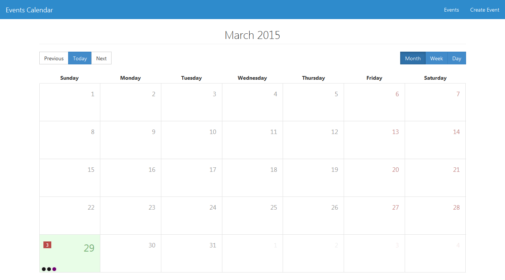
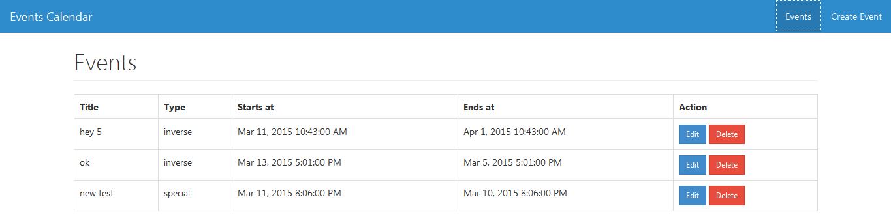

# Events Calendar



## REST API
http://hkapi.herokuapp.com/events/

## Frontend - `MEAN stack`

```
HTML5
CSS3
Bootstrap 3
Angular JS
Node JS
Mongo DB
```

## SETUP

```
git clone https://github.com/hs105133/events-calendar.git
cd events-calendar
npm install
node server.js
```

now do any changes  in `public` folder and see effect here http://localhost:5000/#/

## Features

- Support for multiple views (day, week, month)
- Option to view the events by date
- See all created events



- Create new event
- View specific events
- Update existing event
- Delete existing event

